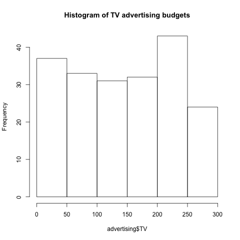
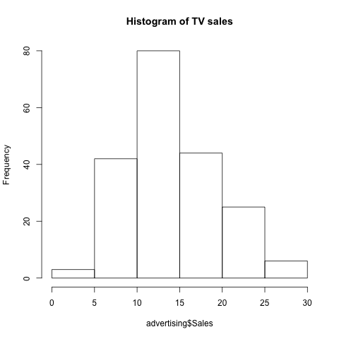
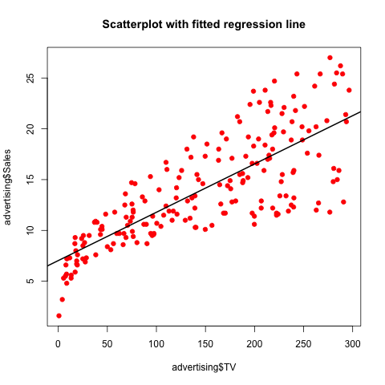

```{r, echo=FALSE}
library(xtable)
options(xtable.comment = FALSE)
```

# Abstract 

In this report, we reproduce the main results displayed in section 3.1 Simple Linear Regression (chapter 3) of the book [An Introduction to Statistical Learning](http://www-bcf.usc.edu/%7Egareth/ISL/ISLR%20Sixth%20Printing.pdf). 

# Introduction

The overall goal is to explore whether increasing TV advertising budgets will improves sales. In this report, we specifically look at how TV advertising budgets affect sales by calculations and plotting graphs. If a relationship exists between TV advertising budgets and sales, then we want to build a good linear model that can be used for sales prediction based on TV advertising budget.


# Data

The [advertising dataset](http://www-bcf.usc.edu/%7Egareth/ISL/Advertising.csv) consists of Sales(in thousands of units) of a particular product in 200 different markets, along with advertising budgets (in thousands of dollars) for the product in each of those markets for three different media (TV, Newspaper and Radio). But we will only explore the association between TV advertising budgets and sales in this report.

# Methodology

We consider Sales and TV advertising budgets in our dataset and try to fit them in a simple linear regression model:

\begin{center}
$Sales = \beta_0 + \beta_1TV$
\end{center}

In order to estimate two coefficients $\beta_0$ and $\beta_1$, we fit the linear regression model via the least square criterion.


# Exploration 
First, let's explore our data. 

```{r, results='asis', echo=FALSE}
advertising <- read.csv("../data/Advertising.csv", sep = ",", row.names = 1)
tvsummary <- summary(advertising$TV)
salessummary <- summary(advertising$Sales)
sum <- matrix(ncol = 6, nrow = 2)
sum[1,] <- tvsummary
sum[2,] <- salessummary
rownames(sum) <- c('TV', 'Sales')
colnames(sum) <- names(salessummary)
print(xtable(sum, caption = "Data Summary"), comment=FALSE)
```

As we can see, we have several statitics, including Min, 1st Quatile, Median, Mean, 3rd Quatile and Max. We can get some initial impressions about data but we need to explore more in depth. 

Then, let's take a look at their histograms.



As we can see, the frequencies of TV advertising budgets are approxiaately even. 




As we can see, the frequencies of Sales form a bell shape distribution. Now, let's try to fit a linear model.


# Linear Model Results
We compute the regression coefficients in Table 2 below:

```{r, results='asis', echo=FALSE}
load(file = "../data/regression.RData")
sum <- summary(reg)
table2 <- xtable(sum, caption = "Information about Regression Coefficients")
print(table2, comment=FALSE)
```

From the **Table2**, we can see that the slope of our linear model is around 0.0475 and the intercept point is at 7.0326. 

This implies that if TV advertising budgets increase by 1 thousands dollars, Sales will increase by about 0.0475 thousands of units. This also implies that if TV advertising budget is zero, Sales will still be around 7.0326 thousands of units. But our model may not be reliable. So let's check if our model is reliable or not.

```{r, results='asis',echo=FALSE}
summary_fields <- c("Residual standard error", "R Squared", "F-Statistics")
summary_values <- c(sum$sigma, sum$r.squared, sum$fstatistic[1])

summary_df <- data.frame(summary_fields, summary_values)

colnames(summary_df) <- c("Quantity", "Value")
table3 <- xtable(summary_df, caption = "Regression Quality Indicies")
print(table3, comment=FALSE)
```

From the **Table3** above, we can see that the **R Squared**, which is a indicator of correlatin between Sales and TV advertising budgets,is 0.61. I would say 0.61 is not very high, which means it's not good enough. 

The **Residual Standard Error**, the average amount that Sales deviate from the true regression line, is 3.26. That means the average deviation of Sales from our predicted value is about 3260 units. 3260 is fairly large since the mean of Sales is only around 14000. So I would say our predicted linear model is not very reliable.

At last, from the scatterplot graph of **Figuer 3**, we can see that the deviation becomes larger and larger as TV advertising budgets increase. 



\newpage
That means our model becomes more unreliable as TV advertising budgets increase.

# Conclusion

Our linear regression model is able to make relatively reliable prediction when TV advertising budget is small. The reliability of our prediction decreases as TV advertising budget gets larger. This problem can be possiblely solved by fitting a model from a larger dataset, fitting a different model or removing outliers.
